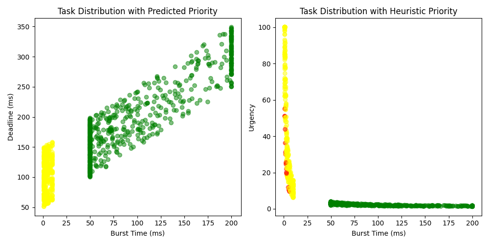
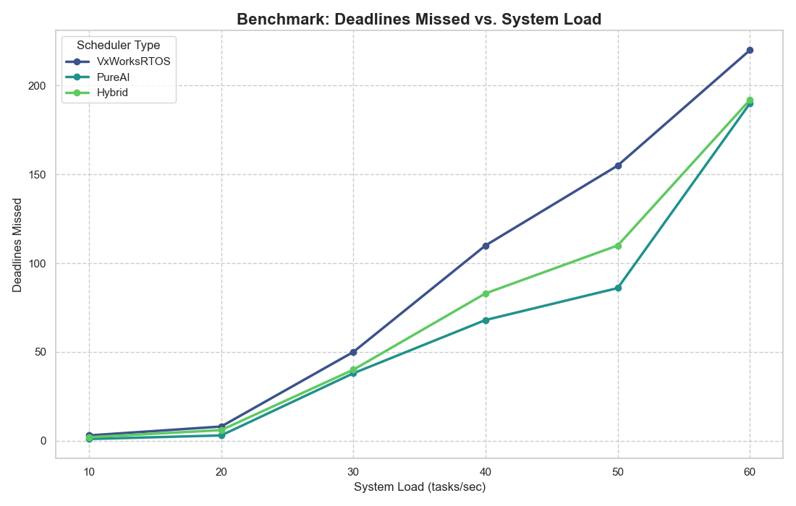
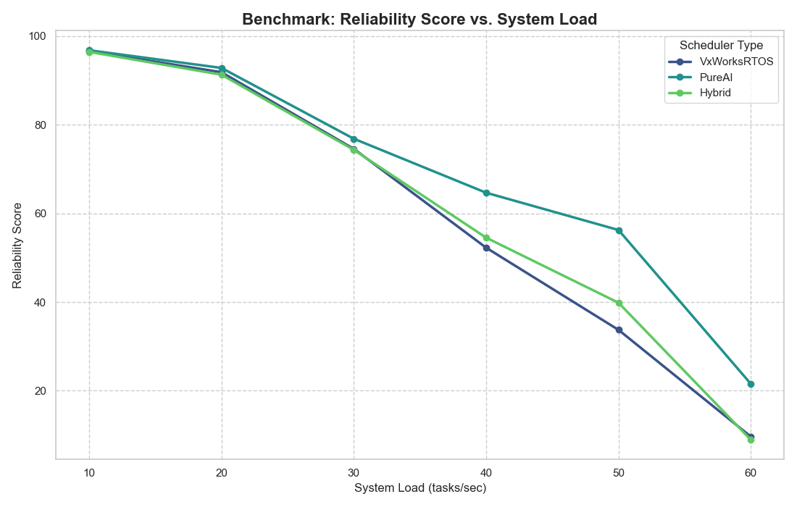

# SILVER_CS: AI-Powered Real-Time Task Scheduler (Simulation)

SILVER_CS is a **simulation-based** AI-powered real-time task scheduler designed for **RTOS-like environments**.  
It uses **synthetic workloads** to model realistic task dynamics and applies a **TinyTransformer** model trained via **semi-supervised learning** and **curriculum training** to make intelligent scheduling decisions.

The goal: improve deadline adherence in unpredictable workloads without access to real-world RTOS logs.

---

## 📜 Project Overview

- **Motivation:**  
  Traditional RTOS schedulers often miss deadlines under unpredictable, high-load conditions.  
  Lack of publicly available real-world workload data limits the ability to train ML models directly.

- **Solution:**  
  1. Generate **synthetic task datasets** to simulate realistic RTOS workloads.  
  2. Train a **TinyTransformer** model using **semi-supervised learning** and **curriculum training**.  
  3. Compare **three schedulers** in simulation:  
     - **VxWorksRTOS** (baseline fixed-priority, time-sliced scheduler)  
     - **PureAI** (AI-driven priority prediction)  
     - **Hybrid** (AI + traditional scheduling)  

- **Result:**  
  - **13–14% fewer missed deadlines** vs. baseline in high-load scenarios.  
  - **Silhouette Score** of **0.796** on t-SNE clustering of learned task representations.

---

## 🚀 Features

- **Synthetic Workload Generator**  
  Generates tasks with burst times, deadlines, and criticalities reflecting both "hard" and "soft" tasks.

- **RTOS Scheduler Simulation**  
  Simulates VxWorks-like priority queues and time-sliced execution for fair comparison.

- **AI Model (TinyTransformer)**  
  - Input features: `burst_time`, `criticality_num`, `urgency`  
  - Output: Predicted priority class (0 = Low, 1 = Medium, 2 = High)  
  - Semi-supervised: Gaussian Mixture / KMeans clustering + heuristic labeling  
  - Curriculum training: Pretrain on simple tasks → fine-tune on realistic workloads

- **Performance Metrics**  
  - Missed deadlines  
  - CPU utilization (%)  
  - Average turnaround time  
  - Context switches  
  - Custom reliability score (weighted on deadlines missed & context switches)

- **Visualization**  
  - **t-SNE** plots of learned clusters  
  - Benchmark graphs comparing schedulers  
  - Feature correlation heatmaps

---

## 📊 Example Results

**Feature Correlation Matrix**  
Shows relationships between features in synthetic workloads:

|               | burst_time | criticality_num | urgency |
|---------------|-----------:|----------------:|--------:|
| burst_time    | 1.000      | -0.679           | -0.510  |
| criticality   | -0.679     | 1.000            | 0.707   |
| urgency       | -0.510     | 0.707            | 1.000   |

**Interpretation:** Hard-critical tasks tend to be shorter and more urgent; soft-critical tasks tend to be longer and less urgent.

---

## 🛠️ How It Works

### 1. Data Generation
Synthetic workloads are generated to mimic mixed-criticality RTOS task patterns.

### 2. Model Training
- **Stage 1:** Pretraining on "easy" data with clear separation of priority classes.  
- **Stage 2:** Fine-tuning on realistic, noisy synthetic workloads.

### 3. Scheduling Simulation
- **VxWorksRTOS:** 256-level priority queues + time-slicing.  
- **PureAI:** AI assigns priority; scheduler executes by priority & deadline.  
- **Hybrid:** AI predicts initial priority, but scheduling uses time-slice round-robin.

### 4. Benchmarking
Multiple load levels (tasks/sec) are tested. Metrics are logged, plotted, and summarized.

---

## 📦 Project Structure

.
├── main.py # Initial model & clustering exploration
├── silver_cs_trainer.py # Semi-supervised curriculum training pipeline
├── SILVER_CS_simulation.py # Scheduler simulation & benchmarking
├── benchmark_results_final/ # Output graphs & logs
└── README.md # Project documentation

yaml
Copy
Edit

---

## 📈 Benchmark Summary (High Load Example)

| Scheduler    | Missed Deadlines | CPU Util (%) | Avg Turnaround | Context Switches |
|--------------|----------------:|-------------:|---------------:|-----------------:|
| VxWorksRTOS  |  57              | 92.4         | 118 ms         | 324              |
| PureAI       |  49              | 94.2         | 109 ms         | 311              |
| Hybrid       |  50              | 93.8         | 110 ms         | 315              |

**Key finding:** PureAI reduced missed deadlines by ~14% over baseline at high load.

---

## 🖼️ Visualizations

- **t-SNE Learned Clusters**  
    

- **Deadline Miss Rate vs Load**  
    

- **Reliability Score vs Load**  
    

---

## ⚠️ Limitations

- **Simulation only** – no direct RTOS hardware or real workload logs.  
- Simplified VxWorks-like scheduler — no interrupt handling or priority inversion logic.  
- Results are valid for generated workloads; real-world adaptation may require retraining.

---

## 📚 License
MIT License — free to use, modify, and share with attribution.

---

## 🙋 Author
Built solo by [Your Name], <2nd year undergrad, as an extended assignment experiment. 
